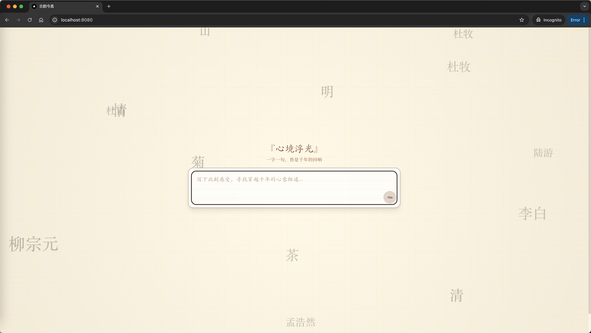

This is a [Next.js](https://nextjs.org/) project bootstrapped with [`create-next-app`](https://github.com/vercel/next.js/tree/canary/packages/create-next-app).

## Getting Started

Run the frontend:

```bash
npm run dev

```
Run the backend:
```bash
npm run flask-dev
```
Open [http://localhost:8080](http://localhost:8080) with your browser to see the result.

## Demo




点击card翻转可看到诗词的解释


## Online

http://47.97.4.73:8080
